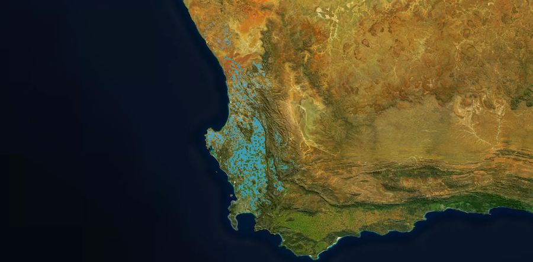
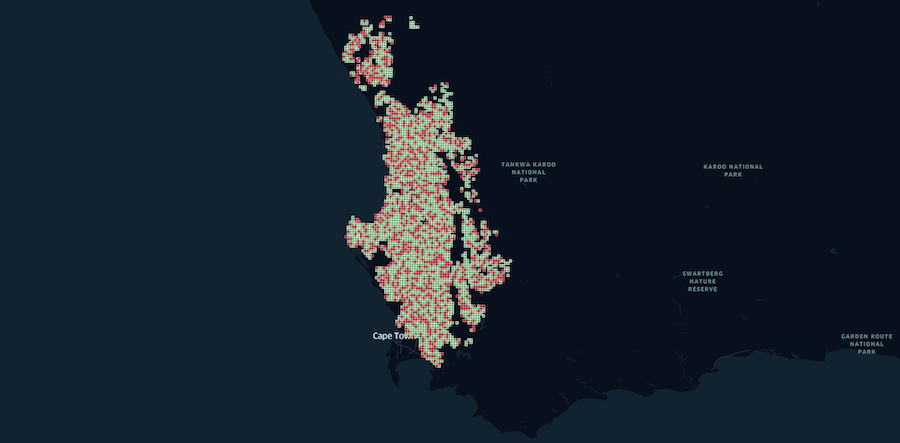

# ***Spot the crop from the top*** 

## ***What is it about***?

At first glance, it merely looks like a submission to the competition [Radiant Earth Spot the Crop XL Challenge](https://zindi.africa/competitions/radiant-earth-spot-the-crop-xl-challenge) on the Zindi community website. 

But it really is the final step of the Data Science Bootcamp with neuefische GmbH. Three participants teamed up to ***WhoKeras*** and used their knowledge gained during 12 weeks of intense learning. 

[result](https://drive.google.com/file/d/1w9xoRebIJW5QgGtH4b0s4LpdXFXj8tNT/view)

## ***Scope***

The competition consists in predicting the crop type of agricultural cultivation fields in South Africa, specifically in the Western Cape. The necessary data has been provided by the competition owner.

## ***Data description***

The supplied data consists of a time series of multispectral satellite images taken by two different satellites, [Sentinel-1](https://sentinel.esa.int/web/sentinel/missions/sentinel-1) and [Sentinel-2](https://sentinel.esa.int/web/sentinel/missions/sentinel-2). In addition to the above, the field boundaries are given as well. Finally, the data set is split into train- and test data.

|  | 
|:-:| 
| ***Image distribution (train/test split)*** |

---
## ***Evaluation metric***
The competition owner prescribed the evaluation metric to use. In this case, the Cross-Entropy-Loss is used.

## ***Technical approach***

### ***Feature engineering***
Extensive Feature Engineering has been conducted. As a first idea, we wanted to ***use the metadata only*** to train a model and then finally predict the crop type.
- Elevation data
  - In addition to the provided data, openly accessible elevation data has been used. See also https://pypi.org/project/elevation/

- Field neighbors
  - A search radius of 4km ha been established to find the neighbor tiles. Information such as most common crop type has been evaluated in the 8 neighbor tiles

- Detect usable images
  - Cloud detection: On some days, on the Sentinel-2 images the fields were not visible due to clouds. Our first approach was to simply not use the images of these days. Obviously, this leads to data loss.  
  - Black area detection: Similar to the cloud detection, we detected black areas on some images. We established a threshold of 20%- if more than 20% of the total image area is black, we do not use the image. Again, obviously this leads to data loss.

- Stack all bands into a single image (tile wise, usable images)
  - all sigle bands
  - special band combinations
    - NDVI
    - moisture index
    - bare-soil index

### ***Model selection***

As baseline model a AdaBoost Classifier has been used. The second model was based on a basic neural network (Keras) which consisted of dense layers and drop out layers. This layout increased the obtained accuracy values. Up to this point, the actual ***multispectral satellite images were not used***, only in terms of feature engineering (mean value and variance of each field).

The last model which has been developed is based on CNN with a LSTM layer.

## Python environment (WIP)

Python xxx. has been used, the development envoirnment can be recreated using the [requirements.txt](requirements.txt) file. 

## The Team
- [PerezCorrea](https://github.com/PerezCorrea)
- [AdrainTheopold](https://github.com/AdrianTheopold/)
- [AIMPED](https://github.com/AIMPED/)
